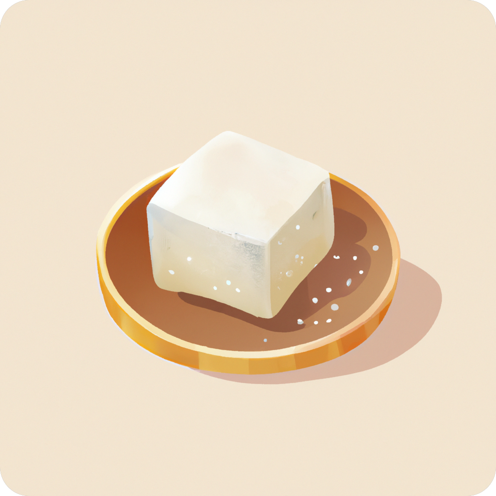

#    Tofu3D Game Engine

Simple .NET C# OpenTK game engine with editor.
Heavily in progress so things will break :)

# Building
You need: glfw, .Net 8

run
```
dotnet build --configuration "CONFIGURATION"
dotnet run --configuration "CONFIGURATION"
```
Replace "CONFIGURATION" with needed configuration:<br>
"MacOS Release"<br>
"MacOS Debug"<br>
"Windows Release"<br>
"Windows Debug"<br>
"Linux Release"<br>
"Linux Debug"<br>

<a href="https://youtu.be/9DruwMWLJRM">[5/4/2023] Video - OBJ Models and Shadows // Tofu3D C# OpenGL Game Engine</a><br>
<a href="https://www.youtube.com/watch?v=fC4k5OtizUE">[3/4/2023] Video - Shadows and Skybox // Tofu3D C# OpenGL Game Engine preview</a><br><br>
<a href="/Github%20Resources/screen4.png"></a>
<a href="/Github%20Resources/screen3.png"></a>
<a href="/Github%20Resources/screen2.png"></a>
<a href="/Github%20Resources/screen1.png"></a>


OpenTK ImGui implementation from https://github.com/NogginBops/ImGui.NET_OpenTK_Sample

Used code
<a href="https://github.com/MonoGame/MonoGame" title="MonoGame">Vector and other classes from MonoGame</a><br>
<a href="https://github.com/NogginBops/ImGui.NET_OpenTK_Sample" title="ImGui Sample">Dear Imgui Sample using OpenTK</a><br>
Used assets
<a href="https://www.flaticon.com/free-icons/count" title="count icons">Count icons created by Freepik - Flaticon</a><br>
<a href="https://www.flaticon.com/free-icons/warning" title="warning icons">Warning icons created by Phoenix Group - Flaticon</a><br>
<a href="https://www.flaticon.com/free-icons/close" title="close icons">Close icons created by Ilham Fitrotul Hayat - Flaticon</a><br>
<a href="https://www.flaticon.com/free-icons/about" title="about icons">About icons created by Ilham Fitrotul Hayat - Flaticon</a>
<a href="https://sketchfab.com/3d-models/minecraft-grass-block-6fd5c3e0bfcc417e932723c651617c0e" title="Grass Block">Grass Block model by S3R84N</a>
